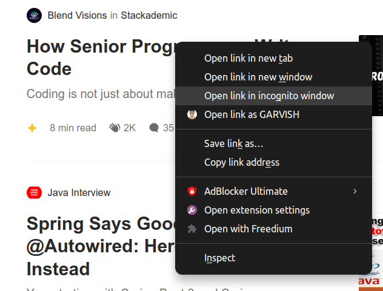

# **Freedium Direct Opener** 🌐🚀

A **Chrome extension** that adds a custom right-click menu option to **open links directly in a new tab**. Perfect for quickly accessing content with a seamless browsing experience.

## **Features** ✨
✅ Adds a right-click menu for links
✅ Instantly opens the selected link in a new tab
✅ Works on most websites
✅ Lightweight and easy to use




## **Installation** 🛠
1. **Download or clone** the repository:
   ```bash
   git clone https://github.com/gppa-odoo/freedium-direct-opener.git
   ```
2. Open **Chrome** and go to `chrome://extensions/`.
3. Enable **Developer Mode** (toggle in the top right).
4. Click **"Load unpacked"** and select the extension folder.
5. Right-click any link → Select **"Open Link"** 🎉

## **Usage** 🚀
- Right-click on any link
- Select **"Open Link"** from the context menu
- The link opens in a new tab instantly

## **Manifest Permissions** 🛡
- `"contextMenus"` → Adds the custom right-click menu
- `"tabs"` → Opens the link in a new tab
- `"scripting"` → Ensures smooth execution of scripts
- `"host_permissions": ["<all_urls>"]` → Allows execution on all sites

## **Customization** 🔧
Modify `background.js` to:
- Open links in the **same tab**
- Open links in a **new window**
- Append **custom parameters** to the URL

---

### **Contributions & Issues** 💡
Feel free to fork this repo, submit PRs, or report issues in the [Issues](https://github.com/gppa-odoo/freedium-direct-opener/issues) section.

🔗 **GitHub Repository:** [your-repo-link](https://github.com/gppa-odoo/freedium-direct-opener/)]

🚀 Enjoy faster browsing with **Freedium Direct Opener**!
